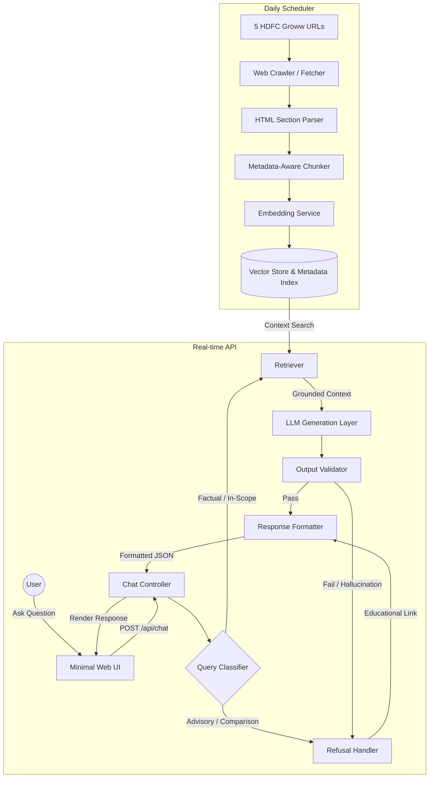

# Architecture Design: Mutual Fund FAQ Assistant (Facts-Only Q&A)

This document describes the system architecture for the facts-only, Retrieval-Augmented Generation (RAG) FAQ assistant. The system is scoped strictly to five HDFC Mutual Fund scheme pages on Groww as its primary corpus. It is designed to answer factual questions (including fund management, expense ratios, and load details) while robustly filtering out and refusing any advisory or comparison queries.

---

## 1. Architectural Design Goals

| Goal | Architectural Implication |
| :--- | :--- |
| **Facts-only answers** | Retrieval is strictly grounded in the curated corpus. The LLM is heavily constrained by system prompts and post-generation validation checks. |
| **Source-backed responses** | Every output contains exactly one citation URL mapped directly to the chunk's source URL metadata. |
| **Compliance & Safety** | Advisory or comparative queries (e.g., "Should I invest?") are classified and rejected before reaching the retrieval or generation layer. |
| **Accuracy over Intelligence** | The system values factual verification and citation accuracy over open-ended conversational intelligence or speculative inference. |
| **Transparency** | Enforces a strict response contract: `≤3 sentences` + `1 citation link` + a `Last updated from sources: <date>` footer. |
| **Privacy & Zero PII** | Completely stateless backend. No user logins, cookies, tracking, or persistence of PII (PAN, Aadhaar, Account Numbers, OTP, etc.). |

---

## 2. High-Level Architecture Overview

The system runs on two distinct cycles:
1. **Offline Indexing (Daily Scheduler at 10:00 AM)**: Crawls the 5 scheme pages, cleans the HTML, parses sections, splits text, generates embeddings, and updates the local vector store.
2. **Online Query Processing (Real-time)**: Handles user requests, classifies them, retrieves context if factual, runs LLM generation with grounding constraints, validates the output, and formats the response.



---

## 3. Component Details

### 3.1 Data Ingestion Pipeline (Offline)

* **Crawler/Fetcher**: Downloads the HTML pages from the 5 Groww URLs:
  1. `https://groww.in/mutual-funds/hdfc-mid-cap-fund-direct-growth`
  2. `https://groww.in/mutual-funds/hdfc-large-cap-fund-direct-growth`
  3. `https://groww.in/mutual-funds/hdfc-small-cap-fund-direct-growth`
  4. `https://groww.in/mutual-funds/hdfc-gold-etf-fund-of-fund-direct-plan-growth`
  5. `https://groww.in/mutual-funds/hdfc-defence-fund-direct-growth`
* **Daily Ingestion Scheduler**: A background scheduler process (e.g., system cron, APScheduler, or a GitHub Actions scheduled workflow) triggers the ingestion process daily at 10:00 AM. When triggered, it executes the pipeline (fetch, parse, chunk, embed) to refresh the vector store and metadata index with the latest scheme data.
* **HTML Section Parser**: Extracts scheme-specific metadata and breaks the HTML layout into structured segments corresponding to:
  * `overview` (NAV, AUM, category, risk label)
  * `expense_ratio` (expense ratio, tax implications)
  * `exit_load` (exit load terms, lock-in period)
  * `minimum_investment` (minimum SIP and lump sum amounts)
  * `benchmark` (benchmark index details)
  * `fund_management` (fund manager name, tenure, education, and career experience)
* **Metadata-Aware Chunker**: Splits section texts into small chunks (200–400 tokens) ensuring that critical factual segments (like fund manager bios or exit load structures) remain unified.
* **Vector Store**: A lightweight local vector database (e.g., ChromaDB, FAISS, or LanceDB) that stores chunk embeddings alongside metadata:
  ```json
  {
    "id": "hdfc-mid-cap-fund-direct-growth#fund_management#0",
    "text": "Chaitanya Choksi is the Fund Manager of HDFC Mid Cap Fund (since Feb 2023). Education: B.Com, CA. Experience: Over 20 years in equity research.",
    "scheme_name": "HDFC Mid Cap Fund Direct Growth",
    "source_url": "https://groww.in/mutual-funds/hdfc-mid-cap-fund-direct-growth",
    "section": "fund_management",
    "last_updated": "2026-06-07"
  }
  ```

### 3.2 Query & Security Classifier (Online Gateway)

Before searching the database, incoming strings are parsed to intercept malicious, non-factual, or personal questions.

```
       [Incoming Query]
              │
              ├── Contains PII? (PAN, Aadhaar, Phone, Email) ──► YES ──► Strip / Mask / Reject
              │
              └── Classifier Logic
                    │
                    ├── Advisory ("Should I invest?", "Which is better?") ──► Reject (Refusal Handler)
                    │
                    └── Factual ("What is the exit load?") ───────────────► Accept (Proceed to Retrieval)
```

#### Query Classification Matrix:
* **Factual Check**: Matches questions on expense ratio, exit load, minimum SIP, benchmark, and fund manager profiles.
* **Advisory Check**: Catches keywords such as "recommend", "should I buy", "better option", "future growth projection", "best fund".
* **Refusal Response**: Instead of raising database queries or invoking LLM reasoning, the classifier immediately routes to a static fallback template delivering a polite denial combined with an official AMFI/SEBI educational link.

### 3.3 Retrieval & Generation Layer

* **Retriever**: Performs semantic search on the query inside the local vector store, constrained by metadata filters. If a specific scheme is detected in the query (e.g., "defence fund"), retrieval is restricted only to documents matching `scheme_name = "HDFC Defence Fund Direct Growth"`.
* **LLM Grounding Prompt**:
  ```text
  You are a facts-only Mutual Fund Assistant. 
  Answer the user's query using ONLY the verified context below.
  If the answer is not present in the context, politely refuse to answer.
  
  Constraints:
  - Do NOT provide investment advice or recommendations.
  - Do NOT compare performance or returns.
  - Limit your answer to a maximum of 3 sentences.
  - Do NOT output any URLs within the answer body.
  
  Context: {retrieved_context}
  Query: {user_query}
  ```
* **Output Validator**: Checks if the LLM output is grounded in the retrieved chunks. If the LLM generates unsupported assertions or violates the sentence limit, the system truncates the text, prompts a regeneration, or falls back to a template-driven refusal.

---

## 4. API & Data Contracts

### 4.1 Chat Endpoint
`POST /api/chat`

**Request Payload**:
```json
{
  "message": "Who manages the HDFC Defence Fund and what is its exit load?"
}
```

**Response Payload (Factual)**:
```json
{
  "answer": "HDFC Defence Fund Direct Growth is managed by Priya Ranjan (since Apr 2025), Dhruv Muchhal (since Jun 2023), and Rahul Baijal (since Apr 2025). The exit load is 1% if redeemed within 1 year from the date of allotment.",
  "citation_url": "https://groww.in/mutual-funds/hdfc-defence-fund-direct-growth",
  "last_updated": "2026-06-07",
  "is_refusal": false,
  "disclaimer": "Facts-only. No investment advice."
}
```

**Response Payload (Refusal)**:
```json
{
  "answer": "I can only answer factual questions about the 5 scoped HDFC schemes in my corpus (such as expense ratios, exit loads, and fund manager details). I cannot provide investment advice or compare funds.",
  "citation_url": "https://www.amfiindia.com/investor-corner/educational-material.html",
  "last_updated": "2026-06-07",
  "is_refusal": true,
  "disclaimer": "Facts-only. No investment advice."
}
```

---

## 5. Technology Stack

* **Frontend**: Vanilla HTML/CSS/JS (embedded in a clean, modern dashboard) or Streamlit for rapid prototyping.
* **Backend Framework**: Python FastAPI (highly optimized, asynchronous endpoints).
* **RAG Orchestrator**: LangChain or LlamaIndex.
* **Vector Store**: Local flat file vector index or ChromaDB (disk-persisted).
* **Embeddings**: BGE-Small (`BAAI/bge-small-en-v1.5`) local semantic embeddings.
* **LLM**: GPT-4o-mini, Gemini 1.5 Flash, or Groq-supported models (highly accurate instruction following at low cost).

---

## 6. Security, Privacy & Guardrails

1. **PII Masking**: Regular expressions scan user inputs for credit cards, phone numbers, email addresses, Aadhaar numbers, and PANs. If matched, the transaction is rejected or masked before forwarding to the retrieval pipeline.
2. **Stateless Mode**: The session history is kept client-side (in the browser). The backend does not persist chats or tie queries to user identity.
3. **Allowlist Citation Enforcement**: The backend validator validates the citation URL against a hardcoded list of the 5 allowed Groww URLs and the AMFI/SEBI educational links. No other URLs can be rendered by the UI.
