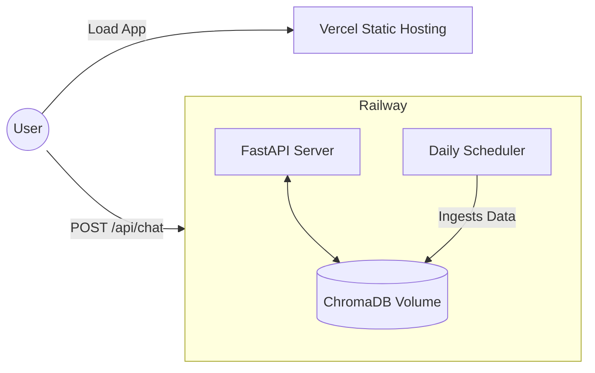

# Deployment Plan: Mutual Fund FAQ Assistant

This document outlines the step-by-step plan for deploying the **Mutual Fund FAQ Assistant** (FastAPI backend + React/Vite frontend + ChromaDB Vector Store + Daily Ingestion Scheduler).

The system can be deployed in two configurations:
1. **Unified Deployment (Railway Only)** - Recommended: Frontend and backend are bundled together, avoiding CORS issues. Ingestion scheduler and local database run on the same instance.
2. **Decoupled Deployment (Vercel Frontend + Railway Backend)** - Frontend is hosted on Vercel for high global availability, while the FastAPI RAG backend, Vector Database, and Ingestion Scheduler run on Railway.

---

## Technical Stack & Infrastructure Requirements

Before choosing a path, review how the component parts run:

| Component | Technology | Runtime | Storage/State Requirements | Hosting Suitability |
| :--- | :--- | :--- | :--- | :--- |
| **Frontend (UI)** | React / Vite | Node.js (build time) | Stateless | Vercel, Railway, Netlify |
| **Backend API** | FastAPI / Uvicorn | Python 3.10+ | Stateless / API endpoints | Railway, Render, AWS |
| **Vector Database** | ChromaDB (local) | Embedded (python) | Persistent disk storage (`./data/index`) | Railway (with Volume), Persistent VPS |
| **Offline Ingestion** | Custom scheduler daemon | Background thread/process | Must write to local ChromaDB | Railway (long-running process) |

> [!WARNING]
> **Vercel Limitations:** Vercel is serverless and completely stateless. You cannot host the Python backend, the daily scheduler daemon, or the ChromaDB instance on Vercel directly because Vercel Serverless Functions have a maximum execution duration (typically 10-60s) and do not support background threads or persistent local disk storage. 

---

## Strategy 1: Unified Deployment on Railway (Recommended)

In this approach, Railway builds the React frontend, places it in the backend's static directory, and deploys a single Python container. The container serves the frontend static assets and hosts the backend API, while the daily scheduler runs in the background.

```mermaid
graph TD
    User((User)) -->|HTTPS| RailwayApp[Railway Container: FastAPI + UI]
    subgraph RailwayApp
        UI[Vite UI dist] <-- Serves statically -- API[FastAPI /api/chat]
        API <--> Chroma[(Chroma DB Volume)]
        Scheduler[Daily Scheduler] -->|Rebuilds Index| Chroma
    end
```

### Steps to Deploy Unified on Railway

#### 1. Add `Dockerfile` to Project Root
Create a `Dockerfile` at the root of the project to build the React application and configure the Python runtime:

```dockerfile
# Step 1: Build the React Frontend
FROM node:20-alpine AS frontend-builder
WORKDIR /ui
COPY ui/package*.json ./
RUN npm install
COPY ui/ ./
RUN npm run build

# Step 2: Set up Python Backend & Runtime
FROM python:3.10-slim
WORKDIR /workspace

# Install system dependencies
RUN apt-get update && apt-get install -y --no-install-recommends \
    build-essential \
    && rm -rf /var/lib/apt/lists/*

# Copy requirements and install python packages
COPY requirements.txt .
RUN pip install --no-cache-dir -r requirements.txt

# Copy built frontend assets to the expected UI dist location
COPY --from=frontend-builder /ui/dist ./ui/dist

# Copy backend application source code
COPY app/ ./app/
COPY ingestion/ ./ingestion/
COPY scheduler/ ./scheduler/
COPY config/ ./config/

# Expose server port
EXPOSE 8000

# Set environment defaults
ENV PORT=8000
ENV HOST=0.0.0.0
ENV CHROMA_PERSIST_DIR=/workspace/data/index

# Start command: runs the FastAPI application
CMD ["python", "-m", "app.main"]
```

> [!NOTE]
> Ensure the FastAPI file `app/main.py` is executed with python module format or matches your run command. Under the hood, `app/main.py` mounts `../ui/dist` correctly: `ui_dist_path = os.path.abspath(os.path.join(os.path.dirname(__file__), "..", "ui", "dist"))`. In our Dockerfile workspace, this path matches exactly.

#### 2. Deploy to Railway
1. Go to [Railway.app](https://railway.app) and sign in.
2. Click **New Project** -> **Deploy from GitHub repo**.
3. Select your repository.
4. Railway will auto-detect the `Dockerfile` and start the build.

#### 3. Attach a Persistent Volume (Critical for ChromaDB)
Because ChromaDB stores embeddings on disk, redeploying or restarting the container will wipe out the database unless a volume is attached:
1. In the Railway project board, click **New** -> **Volume**.
2. Mount the volume to the path `/workspace/data`.
3. In the Service Settings, configure the environment variable:
   `CHROMA_PERSIST_DIR=/workspace/data/index`

#### 4. Configure Environment Variables in Railway
Under the **Variables** tab of the service, add:
* `GROQ_API_KEY`: `your-actual-groq-api-key`
* `PORT`: `8000`
* `HOST`: `0.0.0.0`
* `CHROMA_PERSIST_DIR`: `/workspace/data/index`
* `CRAWL_INTERVAL_HOURS`: `24`

---

## Strategy 2: Decoupled Deployment (Vercel Frontend + Railway Backend)

This configuration hosts the Vite frontend on Vercel and the FastAPI RAG backend + Database on Railway. This structure utilizes Vercel's edge network for lightning-fast frontend delivery.



### Part 1: Backend Deployment on Railway

#### 1. Setup Python Backend Service
1. In Railway, click **New Project** -> **Deploy from GitHub repo**.
2. Choose your repository.
3. In the service settings, set the **Root Directory** to `/` (or leave default root).
4. Set the **Start Command** to run the FastAPI app:
   `uvicorn app.main:app --host 0.0.0.0 --port $PORT`
5. Under **Variables**, add:
   * `GROQ_API_KEY`: `your-groq-api-key`
   * `PORT`: `8000`
   * `HOST`: `0.0.0.0`
   * `CHROMA_PERSIST_DIR`: `/workspace/data/index` (Remember to mount a Railway Volume to `/workspace/data` as detailed in Strategy 1).

### Part 2: Frontend Deployment on Vercel

#### 1. Prepare Frontend Environment Variables
In the frontend code `ui/src/App.jsx`, the API URL is defined as:
```javascript
const API_URL = window.location.port === '5173' ? 'http://localhost:8000/api/chat' : '/api/chat';
```
To support decoupled hosting, update this block or supply a custom configuration in `ui/src/App.jsx` using Vite env variables:
```javascript
const API_URL = import.meta.env.VITE_API_URL || (window.location.port === '5173' ? 'http://localhost:8000/api/chat' : '/api/chat');
```

#### 2. Deploy on Vercel
1. Go to [Vercel.com](https://vercel.com) and log in.
2. Click **Add New...** -> **Project**.
3. Import your GitHub repository.
4. Configure the Project:
   * **Framework Preset**: Vite
   * **Root Directory**: `ui`
   * **Build Command**: `npm run build`
   * **Output Directory**: `dist`
5. Open the **Environment Variables** accordion and add:
   * `VITE_API_URL`: `https://your-railway-backend-url.up.railway.app/api/chat`
6. Click **Deploy**.

---

## Database & Ingestion Operations

Regardless of the deployment layout, the system requires scheme data to be ingested to answer questions.

### Data Bootstrapping (Initial Ingestion)
The backend service on Railway will run the scheduler loop (`scheduler/daily.py`). When the scheduler script initializes, it automatically runs an initial ingestion pipeline run (`ingestion/run.py`), crawls the 5 Groww URLs, extracts facts, embeds the documents using BGE-small, and stores them in `/workspace/data/index`.

### Running Backend API & Ingestion Together
If you are deploying on a single Railway container, you can run both the API and the background daily scheduler together by editing the Dockerfile startup cmd or using a bash script. 

**Alternative combined start command (using a shell script `start.sh`):**
```bash
#!/bin/bash
# Start scheduler in the background
python -m scheduler.daily &
# Start web app in the foreground
uvicorn app.main:app --host 0.0.0.0 --port $PORT
```
To use this, save it as `start.sh` in the project root, make it executable, and update your `Dockerfile` or Railway run command to run `./start.sh`.

---

## Production Security & Compliance Checklist

Before declaring production readiness:
1. **API Keys**: Ensure `GROQ_API_KEY` is kept hidden in Railway's environment variables and never checked into Git.
2. **CORS Restrictions**: In `app/main.py`, replace `allow_origins=["*"]` with your specific Vercel URL to avoid unauthorized domains making requests to your backend:
   ```python
   app.add_middleware(
       CORSMiddleware,
       allow_origins=["https://your-app-frontend.vercel.app"],
       allow_credentials=True,
       allow_methods=["GET", "POST"],
       allow_headers=["*"],
   )
   ```
3. **No PII Persistence**: Confirm the backend maintains zero state logs of user questions that contain credit cards or phone numbers.
