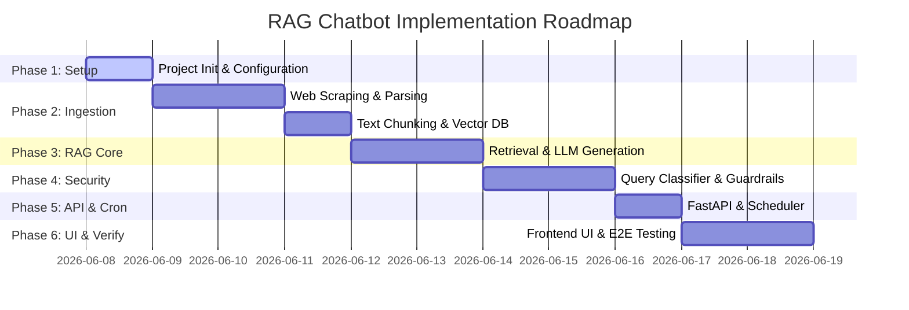

# Implementation Plan: Mutual Fund FAQ Assistant (Facts-Only RAG)

This plan outlines the chronological, phase-wise steps to build and integrate the facts-only Mutual Fund FAQ Assistant RAG system, scoped to five HDFC scheme pages on Groww.

---

## User Review Required

> [!IMPORTANT]
> **Scraping Limitations**: Crawling live pages directly from `groww.in` might trigger Cloudflare bot protections. We propose implementing a fallback mechanism that can parse pre-downloaded HTML snapshots stored in `data/raw/` in addition to live fetching.
>
> **LLM Provider Choice**: We recommend using **Groq** (via the Groq API) for the LLM layer. You will need to provide local environment credentials (e.g., `GROQ_API_KEY`).

---

## Open Questions

> [!NOTE]
> 1. Which embedding model would you prefer alongside the Groq LLM (e.g., a local Hugging Face model like sentence-transformers, or a cloud embedding service)?
> 2. For the daily scheduler, do you prefer a lightweight in-process scheduler (like Python `APScheduler`) or setup instructions for a system-level Cron?

---

## Phase-Wise Roadmap

### Phase 1: Project Setup & Corpus Configuration
Set up the workspace directories, dependency specifications, and corpus configurations.
* **Deliverables**:
  * `requirements.txt` with dependencies (FastAPI, uvicorn, chromadb, requests, beautifulsoup4, pyyaml, groq, sentence-transformers, python-dotenv).
  * `.env.template` specifying the needed API keys (`GROQ_API_KEY` and any embedding provider keys).
  * #### [NEW] [corpus.yaml](file:///c:/Users/ADMIN/Desktop/Product%20Owner/RAG%20Chatboat/config/corpus.yaml)
    * Define metadata for the 5 target HDFC schemes (slugs, official URLs, names, and educational resources).

---

### Phase 2: Data Ingestion & Vector Indexing Pipeline
Build the offline crawler pipeline to fetch Groww URL pages and parse sections into a structured vector database.
* **Subtasks**:
  * **Subtask 2.1: HTML Fetcher Implementation**: Implement crawling in `fetch.py` using HTTP requests and User-Agent headers, including an offline directory snapshot reader mode for local testing.
  * **Subtask 2.2: BeautifulSoup Parsing Engine**: Build parsing rules in `parse.py` to target details for expense ratios, exit load, investment limits, benchmark, and fund manager profiles.
  * **Subtask 2.3: Section-Aware Chunker**: Implement chunking logic in `chunk.py` to keep tabular info and profile bios contextually grouped under named sections.
  * **Subtask 2.4: BGE-Small Vector Index Builder**: Implement local vector indexing in `index.py` using the `BAAI/bge-small-en-v1.5` embedding model.
  * **Subtask 2.5: Ingestion Orchestration Runner**: Code `run.py` to link downloading, parsing, chunking, and indexing into a single script.
* **Deliverables**:
  * #### [NEW] [fetch.py](file:///c:/Users/ADMIN/Desktop/Product%20Owner/RAG%20Chatboat/ingestion/fetch.py)
    * Download HTML content using custom headers; support reading local HTML snapshots.
  * #### [NEW] [parse.py](file:///c:/Users/ADMIN/Desktop/Product%20Owner/RAG%20Chatboat/ingestion/parse.py)
    * Parse page layout using `BeautifulSoup` to isolate Expense Ratio, Exit Load, Minimum Investment, and Fund Management tables/descriptions.
  * #### [NEW] [chunk.py](file:///c:/Users/ADMIN/Desktop/Product%20Owner/RAG%20Chatboat/ingestion/chunk.py)
    * Split texts by parsed sections to maintain contextual grounding for each topic.
  * #### [NEW] [index.py](file:///c:/Users/ADMIN/Desktop/Product%20Owner/RAG%20Chatboat/ingestion/index.py)
    * Compute `BAAI/bge-small-en-v1.5` embeddings and save the vectors into a local ChromaDB store along with scheme metadata.
  * #### [NEW] [run.py](file:///c:/Users/ADMIN/Desktop/Product%20Owner/RAG%20Chatboat/ingestion/run.py)
    * Orchestrate the ingestion process as a single executable job.

---

### Phase 3: Core Retrieval & LLM Generation Engine
Implement the core Q&A cycle by retrieving grounded context and prompting the LLM.

* **Part A: Core Retrieval Engine**
  * **Subtask 3.1: Scheme Resolution (Stage 1 - Metadata Filter Extraction)**:
    * Parse the incoming question to detect matching scheme keywords (e.g. "defence", "mid cap", "large cap", "small cap", "gold").
    * Match keywords to the corresponding Groww scheme slug to construct a strict metadata filter (e.g., `{"slug": "hdfc-defence-fund-direct-growth"}`).
  * **Subtask 3.2: Retrieval Match Engine (Stage 2 - Database Search)**:
    * **If ChromaDB is used**: Connect to the persistent client, generate the query embedding using BGE-small, and call `collection.query(query_embeddings=[...], where={"slug": resolved_slug}, n_results=2)`.
    * **If Fallback Index is used**: Load `data/index/index.json` (for BGE-small) or `.pkl` files (for TF-IDF). Compute cosine similarity between the query vector/TF-IDF representation and chunk vectors. Filter chunks matching the resolved scheme slug, sorting to return the top 2 matching segments.
  * **Deliverables**:
    * #### [NEW] [retriever.py](file:///c:/Users/ADMIN/Desktop/Product%20Owner/RAG%20Chatboat/app/retriever.py)
      * Match scheme keywords, apply metadata filters, calculate vector/lexical similarities, and retrieve the top-scoring context chunks.

* **Part B: LLM Generation Engine**
  * **Subtask 3.3: Strict Prompt Assembly**: Compile the retrieved chunks and user query into a safety-grounded prompt (enforcing the facts-only constraint).
  * **Subtask 3.4: Groq API Client Integration**: Configure connection to the Groq API using Llama-3-8b-8192 or equivalent to generate responses.
  * **Deliverables**:
    * #### [NEW] [generator.py](file:///c:/Users/ADMIN/Desktop/Product%20Owner/RAG%20Chatboat/app/generator.py)
      * Assemble context, invoke Groq model, and retrieve raw completion text.

---

### Phase 4: Query Classification, Safety Guardrails & Refusal
Implement safety filters to block PII, advisory questions, comparisons, and out-of-scope inquiries.
* **Deliverables**:
  * #### [NEW] [classifier.py](file:///c:/Users/ADMIN/Desktop/Product%20Owner/RAG%20Chatboat/app/classifier.py)
    * Route inputs based on query intent (Factual vs. Advisory/Comparison vs. PII block).
  * #### [NEW] [validator.py](file:///c:/Users/ADMIN/Desktop/Product%20Owner/RAG%20Chatboat/app/validator.py)
    * Check output constraints (sentence limit ≤ 3, check facts grounding, verify citation validity).
  * #### [NEW] [formatter.py](file:///c:/Users/ADMIN/Desktop/Product%20Owner/RAG%20Chatboat/app/formatter.py)
    * Re-assemble the response with citation links and a `Last updated from sources` date footer.

---

### Phase 5: API Endpoints & Daily Scheduler Integration
Establish the runtime service layer and configure the automatic daily updates.
* **Deliverables**:
  * #### [NEW] [main.py](file:///c:/Users/ADMIN/Desktop/Product%20Owner/RAG%20Chatboat/app/main.py)
    * Create a FastAPI server serving chat endpoints (`POST /api/chat`) and mapping static files.
  * #### [NEW] [daily.py](file:///c:/Users/ADMIN/Desktop/Product%20Owner/RAG%20Chatboat/scheduler/daily.py)
    * Execute `run.py` automatically daily at 10:00 AM using system scheduler wrappers (cron / `APScheduler`).

---

### Phase 6: Minimal Chat UI & System Verification
Build the user interface and verify correctness through integration tests.
* **Deliverables**:
  * #### [NEW] [index.html](file:///c:/Users/ADMIN/Desktop/Product%20Owner/RAG%20Chatboat/ui/index.html)
    * Minimal chat browser page with interactive input, clickable example questions, disclaimer labels, and citation displays.
  * #### [NEW] [test_classifier.py](file:///c:/Users/ADMIN/Desktop/Product%20Owner/RAG%20Chatboat/tests/test_classifier.py) & [test_retrieval.py](file:///c:/Users/ADMIN/Desktop/Product%20Owner/RAG%20Chatboat/tests/test_retrieval.py)
    * Verify classification rules and response grounding.

---

## Verification Plan

### Automated Tests
- Execute test scripts using:
  `python -m unittest discover -s tests`

### Manual Verification
- Launch server and check frontend UI.
- Test queries:
  - Factual: *"Who manages HDFC Small Cap Fund and what is its exit load?"* (Check grounding, citation URL, ≤3 sentences length, and footer).
  - Advisory: *"Should I invest in HDFC Mid Cap?"* (Check routing to refusal template and presence of SEBI/AMFI educational links).
